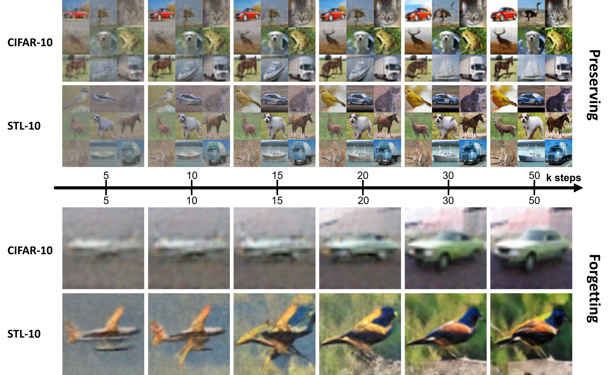
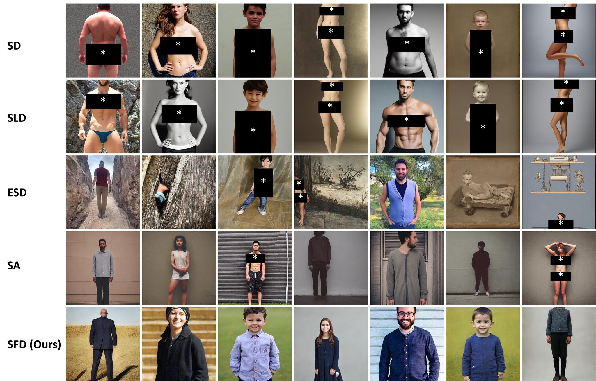

<div align="center">

##  Score Forgetting Distillation: A Swift, Data-Free Method for Machine Unlearning in Diffusion Models (SFD) <br><sub> Official PyTorch Implementation of the ICLR 2025 Paper </sub>



<details>
<summary> Warning: Contains figures with censored inappropriate content. </summary>
<pre>
</pre>
</details>

**Score Forgetting Distillation: A Swift, Data-Free Method for Machine Unlearning in Diffusion Models** <br> Tianqi Chen, Shujian Zhang, Mingyuan Zhou <br> [https://arxiv.org/abs/2409.11219](https://arxiv.org/abs/2409.11219) <br> **Abstract:** The machine learning community is increasingly recognizing the importance of fostering trust and safety in modern generative AI (GenAI) models. We posit machine unlearning (MU) as a crucial foundation for developing safe, secure, and trustworthy GenAI models. Traditional MU methods often rely on stringent assumptions and require access to real data. This paper introduces Score Forgetting Distillation (SFD), an innovative MU approach that promotes the forgetting of undesirable information in diffusion models by aligning the conditional scores of "unsafe" classes or concepts with those of "safe" ones. To eliminate the need for real data, our SFD framework incorporates a score-based MU loss into the score distillation objective of a pretrained diffusion model. This serves as a regularization term that preserves desired generation capabilities while enabling the production of synthetic data through a one-step generator. Our experiments on pretrained label-conditional and text-to-image diffusion models demonstrate that our method effectively accelerates the forgetting of target classes or concepts during generation, while preserving the quality of other classes or concepts. This unlearned and distilled diffusion not only pioneers a novel concept in MU but also accelerates the generation speed of diffusion models. Our experiments and studies on a range of diffusion models and datasets confirm that our approach is generalizable, effective, and advantageous for MU in diffusion models. <br> 
***Warning:** This paper contains sexually explicit imagery, discussions of pornography, racially-charged terminology, and other content that some readers may find disturbing, distressing, and/or offensive.* 

</div>

### Implementations
<!--- Please refer to respective folders (`DDPM` and `SD`) for more details. --->
- (DDPM) Refer to the folder `DDPM` and follow the instructions provided in `README.md`.
- (SD) Refer to the folder `SD` and follow the instructions provided in `README.md`.

**Note:** This version provides an official preview of the experiments described in the paper. While it is intended for educational purposes and for interested readers, some details may differ from the final configurations. For precise experiment setups, including training protocols, evaluation procedures, and hyperparameters, please refer to our paper and future releases as they become available.  

### Citation
```
@article{chen2024score,
  title={Score Forgetting Distillation: A Swift, Data-Free Method for Machine Unlearning in Diffusion Models},
  author={Chen, Tianqi and Zhang, Shujian and Zhou, Mingyuan},
  journal={arXiv preprint arXiv:2409.11219},
  year={2024}
}
```

### License
Apache License 2.0
